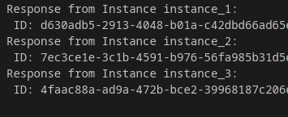
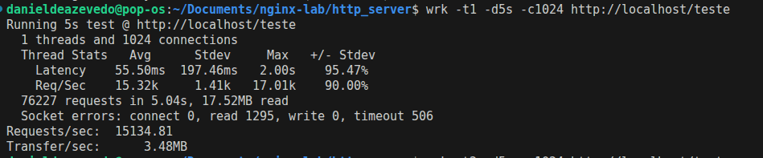

# Lab para testar cenarios simples de uso da ferramenta Nginx

A ideia e abordar diferentes contextos onde o uso desta ferramenta auxilia no processo de desenvolvimento.

## Tecnologias usadas

[Nginx]() - Web server / Proxy Reverso e Load Balancer  
[Docker]() - Criacao / execucao de containers  
[Typescript]() - Linguagem de programacao  
[Rust]()  - Linguagem de programacao  

## Como Testar (SPA)

Uma Aplicacao Simples React para testar o nginx como servidor estatico

Baixe o Projeto:
```bash
git clone https://github.com/DanielDeAzevedoCordeiro1/nginx-lab.git
```

Acesse a pasta nginx-lab e depois spa:
```bash
cd nginx-lab && cd spa
```

Instale as dependencias:
```bash
npm install
```

Suba seu container com a aplicacao:
```bash
docker compose up -d
```

Acesse o endpoint:
```bash
curl localhost:8000/
```

Conteudo retornado:
```html
<!doctype html>
<html lang="en">
  <head>
    <meta charset="UTF-8" />
    <link rel="icon" type="image/svg+xml" href="/vite.svg" />
    <meta name="viewport" content="width=device-width, initial-scale=1.0" />
    <title>spa</title>
    <script type="module" crossorigin src="/assets/index-uV4twp7Y.js"></script>
    <link rel="stylesheet" crossorigin href="/assets/index-CnI6PBz5.css">
  </head>
  <body>
    <div id="root"></div>
  </body>
</html>

```
### Nota:
> O servidor Nginx retornará um HTML padrão que referencia um arquivo `.js`, o qual será carregado pelo navegador e responsável por renderizar o restante da página.  
> Essa é uma característica comum em aplicações do tipo SPA (*Single Page Application*).


## Como Testar (http_server)

Servidor Nginx atuando como load balancer, com 3 instancias/copias de um servidor de testes

Baixe o Projeto:
```bash
git clone https://github.com/DanielDeAzevedoCordeiro1/nginx-lab.git
```

Acesse a pasta nginx-lab e depois spa:
```bash
cd nginx-lab && cd http_server
```

Suba seu container com a aplicacao:
```bash
docker compose up -d
```

Acesse o endpoint:
```bash
curl http://localhost/teste
```

### Nota
> A cada requisição para este endpoint, o servidor encaminhará para uma instância diferente do backend.  
> Como são 3 instâncias, o algoritmo [round-robin](https://dev.to/zanfranceschi/conceito-round-robin-183) envia a primeira requisição ao primeiro servidor e, sucessivamente, às demais instâncias até chegar ao último servidor e reiniciar o ciclo.

### Demonstracao

```bash
curl http://localhost/teste
```



### Testes

> Teste com 1 Worker (Padrao)



Desempenho Single Thread / 1024 conexoes
